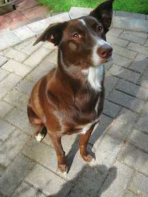
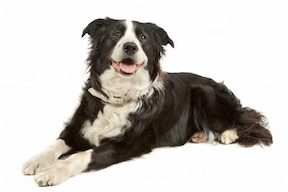

<br><br>

## Introduction

To explore this question, we will be looking at the Austin Animal Center Shelter Intakes and Outcomes dataset from Kaggle.com. The Austin Animal Center is the largest no-kill animal shelter in the United States, and it provides care and shelter to over 18,000 animals each year. The dataset contains intakes and outcomes of animals entering the Austin Animal Center from the beginning of October 2013 to March of 2018.

<br><br>

```{r data, message = FALSE, warning = FALSE, echo = FALSE}
# Loading all necessary packages
library(tidyverse)
library(skimr)
library(janitor)
library(readr)

# Reading in the Austin Animal Shelter dataset
animal_shelter_data <- read_csv("data/aac_intakes_outcomes.csv")
animal_shelter_data <- animal_shelter_data %>% 
  filter(outcome_type != "NA")

cat_data <- animal_shelter_data %>% 
  filter(animal_type == "Cat")

dog_data <- animal_shelter_data %>% 
  filter(animal_type == "Dog")
```

<!-------- Cats -------->

## How long do cats stay in the shelter? 

<br><br>

#### How does coat color affect how long cats stay in the shelter?

First, we will look at the data for cats at the Austin Animal Center. Specifically, we will take a look at how coat color and breed affect the amount of days cats stay at the shelter before their outcomes. Outcomes are defined as what happens to the animal once they leave the shelter. Types of outcomes include: 

* adoption
* death
* euthanization
* return to owner 
* transfer (to a partner or another shelter)

<br>

Figure 1 shows a prelimary view of a subset of the dataset: the mean time spent in shelters by coat color for cats. The mean time spent in shelters is the amount of time an animal is in the shelter before it leaves. 

<br><br>

<!-- Figure 1 -->

```{r cats-mean-time-by-color, fig.width = 14, fig.height = 10, echo = FALSE}
# Process the data
# We are filtering the entire dataset to get only the data on cats. 
cat_mean_colors <- cat_data %>% 
  # Group the data by coat color 
  group_by(color) %>%
  summarize(
    # Getting the mean time spent in the shelter
    mean = mean(time_in_shelter_days),
    se = sd(time_in_shelter_days)/sqrt(n())
  ) %>%
  mutate(color = fct_reorder(factor(color), desc(mean)))

# Plot
ggplot(cat_mean_colors,
       aes(color, mean)) +
       geom_col(width = 0.25, fill = "#56B4E9") +
       labs(x = "Cat Coat Color", y = "Mean Time Spent in Shelter (days)") +
       ggtitle("Figure 1: Mean Time Spent in Shelter by Coat Color in Cats") +
       theme(axis.text.x = element_text(angle = 90, size = 10),
             strip.text = element_text(size = 14), 
             plot.title = element_text(size = 28),
             axis.title = element_text(size = 20),
             axis.text.y = element_text(size = 12), 
             panel.background = element_blank())

# Find the Lynx Point/Tortie Point cats
lynxpoint_tortiepoint <- cat_data %>% 
  filter(color == "Lynx Point/Tortie Point")
lynxpoint_tortiepoint_days <- lynxpoint_tortiepoint$time_in_shelter_days
# Number of days = 270.034

# Find the Brown Tabby/Agouti cats
browntabby_agouti <- cat_data %>% 
  filter(color == "Brown Tabby/Agouti")
browntabby_agouti_days <- browntabby_agouti$time_in_shelter_days
# Number of days = 168.1674
```

<br><br>

From Figure 1, we can see that Lynx Point/Tortie Point colored cats spend the longest time in the shelter, averaging almost 300 days in the shelter. However, when looking back at the data, if we filter it to find all the Lynx Point/Tortie Point cats, there is only one, and she stayed in the shelter for a total of 270 days. Thus, because there is only one Lynx Point/Tortie Point cat in the dataset, it is not accurate to say that Lynx Point/Tortie Point colored cats generally stay in the shelter the longest. 

<br>


<br>

If we take a look at the second longest average time spent at the shelter, we can see that Brown Tabby/Agouti colored cats on average stay in the shelter for the second longest amount of time. Looking through the entire dataset, we can see that again there is only one Brown Tabby/Agouti cat in the dataset, and she stayed in the shelter for 168 days. 

<br>


<br>

Because the dataset includes many coat colors that don't appear frequently, it is difficult to make accurate conclusions about the data. To get a more detailed view of the data, we will take a look at the most commmon coat colors in cats in the dataset. Filtering through the dataset, the 10 most common coat colors are:

1. Black
2. Black and white
3. Orange tabby and white
4. Calico
5. Tortie
6. Brown tabby
7. Blue Tabby
8. Blue 
9. Orange Tabby
10. Torbie

<br>


```{r cats_color_counts, echo = FALSE}
# Finding the most common colors
cats_color_counts <- count(cat_data, vars = color)
cats_color_counts_desc <- cats_color_counts[with(cats_color_counts, order(-n)), ]
```

<br>

Using this information, we can create a new plot that more accurately represents the dataset. Instead of plotting all of the coat colors, we will use the top 10 most frequent colors in order to avoid a skewed plot. 
<br>

Figure 2 shows the mean days spent in the shelter by the 10 most frequent coat colors in cats.

<br><br>

<!-- Figure 2 -->

```{r cats-common-coat-colors, fig.width = 14, fig.height = 10, echo = FALSE}
cat_colors = c("Brown Tabby", "Black", "Black/White", "Orange Tabby", "Tortie", "Calico", "Blue Tabby", "Orange Tabby/White", "Blue", "Torbie")

# Process the data
cat_mean_colors <- cat_mean_colors %>% 
  filter(color %in% cat_colors)

ggplot(cat_mean_colors,
       aes(color, mean)) +
       geom_col(width = 0.95, fill = "#56B4E9") +
       labs(x = "Ten Most Common Cat Coat Colors", y = "Mean Time Spent in Shelter (days)") +
       ggtitle("Figure 2: Mean Time Spent in Shelter by Most Common Coat Colors in Cats") +
       theme(axis.text.x = element_text(angle = 90, hjust = 0, size = 12),
             strip.text = element_text(size = 14), 
             plot.title = element_text(size = 28),
             axis.title = element_text(size = 20),
             axis.text.y = element_text(size = 12),
             panel.background = element_blank())  
```

From Figure 2, we can conclude that cats that stay in the shelter the longest are black cats, averaging over 22.78 days in the shelter before leaving the shelter. The cats that stay in the shelter the second longest are black and white, averaging 22.19 days. Coming in third are orange tabby and white cats with a mean of 20.802 days.

<br><br>

#### How does breed affect how long cats stay in the shelter?

<br><br>

<!-- Figure 3 -->

```{r cats-mean-time-by-breed, fig.height = 10, fig.width = 14, echo = FALSE}
cat_mean_breeds <- animal_shelter_data %>% 
  filter(animal_type == "Cat") %>% 
  group_by(breed) %>%
  summarize(
    mean = mean(time_in_shelter_days),
    se = sd(time_in_shelter_days)/sqrt(n())
  ) %>%
  mutate(breed = fct_reorder(factor(breed), desc(mean)))

ggplot(cat_mean_breeds, 
       aes(breed, mean)) +
       geom_col(width = 0.75, fill = "#2E8B57") +
       labs(x = "Cat Breed", y = "Mean Time Spent in Shelter (days)") +
       ggtitle("Figure 3: Mean Time Spent in Shelter by Breed in Cats") +
       theme(axis.text.x = element_text(angle = 90, hjust = 0, size = 12),
             strip.text = element_text(size = 14), 
             plot.title = element_text(size = 28),
             axis.title = element_text(size = 20),
             axis.text.y = element_text(size = 12), 
             panel.background = element_blank())

# Find the Chartreux Mix
chartreux_mix <- cat_data %>% 
  filter(breed == "Chartreux Mix")
chartreux_mix_days <- chartreux_mix$time_in_shelter_days
```

<br><br>

From Figure 3, we can see that the breed of cat that typically stays in the shelter the longest is the Chartreux Mix. However, if we look at the dataset, there are only 2 chartreux mixes that entered in the shelter from 2013-2018. One was in the shelter for 6.88 days while the other was in the shelter for 366 days. Thus, since there were only 2 Chartreux Mixes and because their data was so widely spread out, this graph does not provide a precise representation of the data. 


<br>

Therefore, just as we did for thte graphics on coat colors in cats, we will look at the most common cat breeds in the dataset in order to get ta more accurate view of the data. 

<br><br>

Filtering through the dataset, the 10 most common cat breeds at the shelter are:

1. Domestic Shorthair Mix
2. Domestic Medium Hair Mix
3. Domestic Longhair Mix
4. Siamese Mix
5. Domestic Shorthair
6. American Shorthair Mix
7. Snowshoe Mix
8. Domestic Medium Hair 
9. Maine Coon Mix
10. Manx Mix

Domestic shorthairs, medium hairs, and longhairs are typically a mix of breeds, otherwise known as a "mutt". Since most of the cats taken in the animal shelter are strays, it is highly plausible that most of these cats would be domestic shorthairs, medium hairs, and longhairs because wild cats mate among different species. 

<!-- Figure 4 -->

```{r cats_breed_counts, echo = FALSE}
# Finding the 10 most common breeds
cats_breed_counts <- count(cat_data, vars = breed)
cats_breed_counts_desc <- cats_breed_counts[with(cats_breed_counts, order(-n)), ]
```

<br>

Figure 4 shows the average number of days spent in the shelter by cat breed. 

<br><br>

<!-- Figure 4 -->

```{r cats-common-breeds, fig.height = 10, fig.width = 14, echo = FALSE}
cat_breeds = c("Domestic Shorthair", "Domestic Medium Hair", "Domestic Longhair", "Domestic Shorthair Mix", "Domestic Medium Hair Mix", "Domestic Longhair Mix", "Siamese", "Maine Coon", "American Shorthair", "British Shorthair", "Russian Blue Mix", "Maine Coon Mix", "Siamese Mix")

cat_mean_breeds <- cat_mean_breeds %>% 
  filter(breed %in% cat_breeds)

ggplot(cat_mean_breeds, 
       aes(breed, mean)) +
       geom_col(width = 0.75, fill = "#2E8B57") +
       labs(x = "Cat Breed", y = "Mean Time Spent in Shelter (days)") +
       ggtitle("Figure 4: Mean Time Spent in Shelter by Breed in Cats") +
       theme(axis.text.x = element_text(angle = 90, hjust = 0, size = 12),
             strip.text = element_text(size = 14), 
             plot.title = element_text(size = 28),
             axis.title = element_text(size = 20),
             axis.text.y = element_text(size = 12), 
             panel.background = element_blank(), 
             plot.background = element_blank())
```

<br>

In conclusion, from Figure 4, we can see that that Domestic Shorthair cats tend to stay in the shelter the longest, followed by Maine Coon Mixes and tthen Domestic Medium Hairs. Domestic Shorthair cats are extremely common in shelters, which could explain why they tend to be in the shelter the longest. 

<br>


<br><br>

<!--- Dogs -->

## How long do dogs stay in the shelter? 

<br>

We will now explore the subset of the dataset that includes dogs. Just as we did for cats, we will look at how coat color and breed affect how long a dog stays in the shelter. 

<br><br>

#### How does coat color affect how long dogs stay in the shelter?

<br>

Figure 5 shows a prelimary view of the average number of days dogs stayed in the shelter by coat color. 

<br><br>

<!-- Figure 5 -->

```{r dogs-mean-time-by-color, fig.width = 14, fig.height = 10, echo = FALSE}
# Process the data
# We are filtering the entire dataset to get only the data on cats. 
dog_mean_colors <- dog_data %>% 
  # Group the data by coat color 
  group_by(color) %>%
  summarize(
    # Getting the mean time spent in the shelter
    mean = mean(time_in_shelter_days),
    se = sd(time_in_shelter_days)/sqrt(n())
  ) %>%
  mutate(color = fct_reorder(factor(color), desc(mean)))

ggplot(dog_mean_colors,
       aes(color, mean)) +
       geom_col(width = 0.25, fill ="#56B4E9") +
       labs(x = "Dog Coat Color", y = "Mean Time Spent in Shelter (days)") +
       ggtitle("Figure 5: Mean Time Spent in Shelter by Coat Color in Dogs") +
       theme(axis.text.x = element_text(angle = 90, size = 10),
             strip.text = element_text(size = 14), 
             plot.title = element_text(size = 28),
             axis.title = element_text(size = 20),
             axis.text.y = element_text(size = 12), 
             panel.background = element_blank())

# Find the Red/Red colored dogs
red_red <- dog_data %>% 
  filter(color == "Red/Red")
```

<br><br>

Viewing Figure 5, we can see that the dog coat color that tends to stay in the shelter the longest is red/red. However, if we refer back to the data, there are only 3 red/red dogs in the entire dataset, with one that spent 330 days in the shelter, another that spent 1825 days, and a third that spent 3650 days in the shelter. Thus, the graph is skewed because of the one red/red dog that spent 3650 days in the shelter.

Therefore, in order to get a more accurate representation of the data, we will focus on the most common dog coats colors, just as we did for the cat data. Processing the dataset, the 10 most common coat colors that we see are: 

1. Black/White
2. Black
3. Brown/White
4. Tan/White
5. White
6. Tan
7. Tricolor
8. Black/Tan
9. Brown
10. White/Black

<br>

Figure 6 shows average time spent in the shelter by coat color for the 10 most common dog coat colors.

<br><br>

<!-- Figure 6 -->

```{r dogs_color_counts, echo = FALSE}
# Finding the most common colors
dogs_color_counts <- count(dog_data, vars = color)
dogs_color_counts_desc <- dogs_color_counts[with(dogs_color_counts, order(-n)), ]
```

```{r dogs-popular-coat-colors, fig.width = 14, fig.height = 10, echo = FALSE}
dog_colors = c("Black/White", "Black", "Brown/White", "Tan/White", "White", "Tan", "Tricolor",
           "Black/Tan", "Brown", "White/Black")

# Process the data
dog_mean_colors <- dog_mean_colors %>% 
  filter(color %in% dog_colors)

ggplot(dog_mean_colors,
       aes(color, mean)) +
       geom_col(width = 0.95, fill = "#56B4E9") +
       labs(x = "Dog Coat Color", y = "Mean Time Spent in Shelter (days)") +
       ggtitle("Figure 6: Mean Time Spent in Shelter by Coat Color in Dog") +
       theme(axis.text.x = element_text(angle = 90, size = 10),
             strip.text = element_text(size = 14), 
             plot.title = element_text(size = 28),
             axis.title = element_text(size = 20),
             axis.text.y = element_text(size = 12), 
             panel.background = element_blank())
```

<br><br>

Therefore, from Figure 6, we can see that brown and white dogs and black and white dogs tend to stay in the shelter the longest. 

<br>





<br><br>

#### How does breed affect how long dogs stay in the shelter?

<br>

We will now explore how breed affect the number of days a dog stays in the shelter before its outcome.

<br>

<!-- Figure 7 -->

```{r dogs-mean-time-by-breed, fig.height = 16, fig.width = 20, echo = FALSE}
dog_mean_breeds <- dog_data %>% 
  group_by(breed) %>%
  summarize(
    mean = mean(time_in_shelter_days),
    se = sd(time_in_shelter_days)/sqrt(n())
  ) %>%
  mutate(breed = fct_reorder(factor(breed), desc(mean)))

ggplot(dog_mean_breeds, 
       aes(breed, mean)) +
       geom_col(width = 0.75, fill = "#2E8B57") +
       labs(x = "Dog Breed", y = "Mean Time Spent in Shelter (days)") +
       ggtitle("Figure 7: Mean Time Spent in Shelter by Breed in Dogs") +
       theme(axis.text.x = element_text(angle = 90, hjust = 0, size = 6),
             strip.text = element_text(size = 14), 
             plot.title = element_text(size = 28),
             axis.title = element_text(size = 20),
             axis.text.y = element_text(size = 12), 
             panel.background = element_blank())
```

<br><br>

Again, in Figure 7, we face the problem where the graph is skewed because 1 or 2 dogs of a certain breed stayed longer than most other dogs. In order to get a more accurate view of the data, we will look at the 10 breeds that most commonly visited the Austin Animal Center. Processing the data, we find that the ten most common breeds are: 

1. Pit Bull Mix
2. Chihuahua Shorthair Mix
3. Labrador Retriever  Mix
4. German Shepherd Mix
5. Australian Cattle Dog Mix
6. Dachshund Mix
7. Boxer Mix
8. Border Collie Mix
9. Miniature Poodle Mix
10. Catahoula Mix


```{r dogs_breed_counts, echo = FALSE}
# Finding the most common colors
dogs_breed_counts <- count(dog_data, vars = breed)
dogs_breed_counts_desc <- dogs_breed_counts[with(dogs_breed_counts, order(-n)), ]
```

<br>

<!-- Figure 8 -->

Figure 8 shows the average number of days stayed at the shelter by breed of dog for the 10 most common breeds.

<br>

```{r dogs-popular-breeds, fig.height = 10, fig.width = 20, echo = FALSE}
dog_breeds = c("Pit Bull Mix", "Chihuahua Shorthair Mix", "Labrador Retriever Mix", "German Shepherd Mix", "Australian Cattle Dog Mix", "Dachshund Mix", "Boxer Mix", "Border Collie Mix", "Miniature Poodle Mix", "Catahoula Mix")

dog_mean_breeds <- dog_mean_breeds %>% 
  filter(breed %in% dog_breeds)

ggplot(dog_mean_breeds, 
       aes(breed, mean)) +
       geom_col(width = 0.95, fill = "#2E8B57") +
       labs(x = "Dog Breed", y = "Mean Time Spent in Shelter (days)") +
       ggtitle("Figure 8: Mean Time Spent in Shelter by Breed in Dogs") +
       theme(axis.text.x = element_text(angle = 90, hjust = 0, size = 12),
             strip.text = element_text(size = 14), 
             plot.title = element_text(size = 28),
             axis.title = element_text(size = 20),
             axis.text.y = element_text(size = 12), 
             panel.background = element_blank(), 
             plot.background = element_blank())
```

<br><br>

From Figure 8, we can see that Pit Bull Mixes and Catahoula Mixes tend to stay in the shelter the longest. Pit Bulls are perceived to be more aggresive than other dogs, which could explain why Pit Bull Mixes tend to stay in the shelter longer than other dogs. Catahoula Mixes are big dogs, which are generally perceived to be more aggressive than small dogs, which could explain why Catahoula Mixes tend to stay in the shelter longer than other dogs. In general, looking at the graph, out of the 10 most common breeds of dogs, the 7 that stay the longest in the shelter are big dogs, while the bottom 3 are all small dogs. 

<br>


<br><br>

<!-- All Animals -->

## How many animals are taken in each year?

<br>

We will now look at the number of animals taken in each year by the Austin Animal Center. 

<br>

<!-- Figure 9 -->

```{r animals-by-year-bar, echo = FALSE}
animal_shelter_data <- animal_shelter_data %>% 
  group_by(intake_year) 
animal_counts <- count(animal_shelter_data, vars = animal_type)

ggplot(animal_counts,
       aes(intake_year, n)) +
       geom_col(aes(fill = vars)) +
       labs(x = "Year animal was taken into shelter", y = "Number of Animals",
            fill = "Type of Animal") +
       ggtitle("Figure 9: Number of Animals Taken in by Year") +
       theme(panel.background = element_blank())

others <- animal_shelter_data %>% 
  filter(animal_type == "Other")
```

<br><br>

From Figure 9, we can see that the most taken in animals are dogs. Coming in second are cats. The least common animals that are taken into the shelter are birds. This seems reasonable, as dogs and cats are more commonly kept as pets than birds and other animals. These other animals are most likely wild animals like rabbits, racooons, and rats, as the most common outcome for these animals are euthanasia due to rabies risk.

Figure 10 shows the trends for the number of animals taken in by year. 

<br>

<!-- Figure 10 -->

```{r animals-by-year-line, echo = FALSE}
ggplot(animal_counts,
       aes(intake_year, n)) +
       geom_point(aes(shape = vars, color = vars)) +
       geom_line(aes(color = vars)) +
       labs(x = "Year animal was taken into shelter", y = "Number of Animals",
            fill = "Type of Animal", shape = "Type of Animal", color = "Type of Animal") +
       ggtitle("Figure 10: Number of Animals Taken in by Year") +
       theme(panel.background = element_blank())
```

<br>

From Figure 10, we can see that from 2013-2014, there was an extremely large increase in the number of dogs and cats taken into the shelter. There was a minor increase in the number of "other" animals, and there were almost no birds taken in. 

From 2014-2015, there was a slight decrease in the number of dogs brought in, but there was a slight increase in the number of cats brought in. There was a slight decrease in the number of "other" animals brought in, but there were still almost 0 birds taken in. 

From 2015-2016, the number of dogs and cats taken in both declined, while there was an increase in the number of "other" animals and birds taken in.

In the year 2016-2017, there seemed to be very little change in the number of animals taken in from the previous year for all animal types.

From 2017-2018, there was an extremely large decrease in the number of cats and dogs taken in. "Other" animals also were taken in less, and very little birds were taken in.

<br><br>

<!-- Adoption -->

## What characteristics affect adoption at the shelter?

<br>

We will now explore the adoption data for the Austin Animal Shelter. 

```{r adoption-data, echo = FALSE}
# Get adoption data for cats and dogs
adoption_data <- animal_shelter_data %>% 
  filter(outcome_type == "Adoption")

cat_adoption_data <- adoption_data %>% 
  filter(animal_type == "Cat") 

dog_adoption_data <- adoption_data %>% 
  filter(animal_type == "Dog")
```

<br>

#### Are black cats adopted less than other cats? 

Black cats have historically been seen as "bad luck" and have been associated with witchcraft. This misconception has often led to black cats not getting adopted as often as other colored cats. However, awareness has risen for black cats, and they seem to becoming more popular. We will test this hypothesis by plotting adoption counts for different colored cats. We will only be looking at the five most common coat colors. 

<br>


<br>

<!-- Figure 11 -->

Figure 11 displays the adoption rates for cats with the 5 most common coat colors.

<br>
 
```{r cat_adoption_top_five_colors, echo = FALSE}
cat_colors_top_five = c("Brown Tabby", "Black", "Black/White", "Orange Tabby", "Tortie")

cat_adoption_data <- cat_adoption_data %>% 
  filter(color %in% cat_colors_top_five)

cat_adoption_counts <- cat_adoption_data %>% 
  group_by(outcome_year, color)

cat_adoption_counts <- count(cat_adoption_counts, vars = outcome_type)

ggplot(cat_adoption_counts, 
       aes(outcome_year, n)) +
       geom_point(aes(color = color, shape = color)) +
       geom_line(aes(color = color)) +
       labs(x = "Year cat was adopted", y = "Number of cats adopted", shape = "5 Most Common Coat Colors",
            color = "5 Most Common Coat Colors") +
       ggtitle("Figure 11: Number of Cats Adopted by Year") +
       scale_color_manual(labels = c("Black", "Black/White", "Brown Tabby", "Orange Tabby", "Tortie"),
                          values = c("black", "#a9a9a9", "#654321", "orange", "#d4aa8e")) +
       theme(panel.background = element_blank())
```

<br>

We can see from Figure 11 that brown tabby cats are adopted the most from the shelter. However, we can also see that black cats are adopted second most. Following brown tabby and black cats are black and white cats, orange tabby cats, then tortoiseshell cats. From 2013-2017, black cats experienced a large increase in number of adoptions, along with brown tabby cats. However, from 2017-2018, there was a large decrease in adoptions in all cats. However, this may be because this dataset only includes data up to March of 2018. 

<br>

#### Are Pitbulls adopted less than other dogs? 

<br>

Pit bulls have been seen as aggressive and dangerous. However, in the past few years, awareness for pit bulls have increased, and more people seem to be adopting them. We will test this theory by plotting adoption counts for different dog breeds. We will only be looking at the five most common dog breeds. 

<br>

<!-- Figure 12 -->

Figure 12 shows the adoption rates for the 5 most common dog breeds.

<br>

```{r dog_adoption_top_five_breeds, echo = FALSE}
dog_breeds_top_five = c("Pit Bull Mix", "Chihuahua Shorthair Mix", "Labrador Retriever Mix", "German Shepherd Mix", "Australian Cattle Dog Mix")

dog_adoption_data <- dog_adoption_data %>% 
  filter(breed %in% dog_breeds_top_five)

dog_adoption_counts <- dog_adoption_data %>% 
  group_by(outcome_year, breed)

dog_adoption_counts <- count(dog_adoption_counts, vars = outcome_type)

ggplot(dog_adoption_counts, 
       aes(outcome_year, n)) +
       geom_point(aes(color = breed, shape = breed)) +
       geom_line(aes(color = breed)) +
       labs(x = "Year dog was adopted", y = "Number of dogs adopted", shape = "5 Most Common Dog Breeds",
            color = "5 Most Common Dog Breeds") + 
       ggtitle("Figure 12: Number of Dogs Adopted by Year") +
       scale_color_manual(labels = c("Australian Cattle Dog Mix", "Chihuahua Shorthair Mix", 
                                     "German Shepherd Mix", "Labrador Retriever Mix", "Pit Bull Mix"),
                          values = c("black", "#a9a9a9", "#654321", "orange", "#d4aa8e")) +
       theme(panel.background = element_blank())
```

<br>

From Figure 12, we can see that not as many Pit Bulls were adopted as Chihuahua Shorthair Mixes and Labrador Retreivers from 2013-2014, but after 2014, the amount of Pit Bulls adopted increased greatly. Thus, this graph shows that Pit Bulls are being adopted more as time goes on. Again, data for 2018 is not available for months after March, so there is an increase in number of adoptions for all breeds from 2017-2018. 

<br><br>

## Trap, Neuter, Release (TNR)

<br>

Trap, Neuter, Release (TNR) is a rescue effort to trap stray cats, neuter them, and then release them in order to curb the number of stray kitten births. TNR is used to 

<br>

#### Has TNR helped to reduce the number of intact males and females that are taken into the shelter?

<!-- Figure 13 -->

```{r general-data, echo = FALSE}
adoptions_by_sex <- animal_shelter_data %>% 
  group_by(sex_upon_intake) %>% 
  filter(sex_upon_intake != "NA" & sex_upon_intake != "Unknown")

adoptions_by_sex <- adoptions_by_sex %>% 
  group_by(intake_year, sex_upon_intake)

adoptions_by_sex <- count(adoptions_by_sex, vars = sex_upon_intake)

ggplot(adoptions_by_sex, 
       aes(intake_year, n)) +
       geom_point(aes(color = sex_upon_intake, shape = sex_upon_intake)) +
       geom_line(aes(color = sex_upon_intake)) +
       labs(x = "Year Taken into the Shelter", y = "Number of cats brought into the shelter", 
            color = "Sex Upon Intake", shape = "Sex Upon Intake") +
       ggtitle("Figure 13: Number of Cats Brought into the Shelter by Year") +
       theme(panel.background = element_blank())
```

<br>

From Figure 13, we can see that the number of intact males and females have decreased over time. Intact means that the cat has not been spayed or neutered yet. The decrease in the number of intact male and female cats shows that TNR has been working to reduce the fertile stray cat population.

<br><br><br><br>

-------------------------------------------------------------------------------------------------------------

The Austin Animal Center Shelter Intakes and Outcomes Dataset is from Kaggle.com, and it was uploaded by Aaron Schlegel. 

Link to the dataset:
https://www.kaggle.com/aaronschlegel/austin-animal-center-shelter-intakes-and-outcomes#aac_intakes_outcomes.csv

